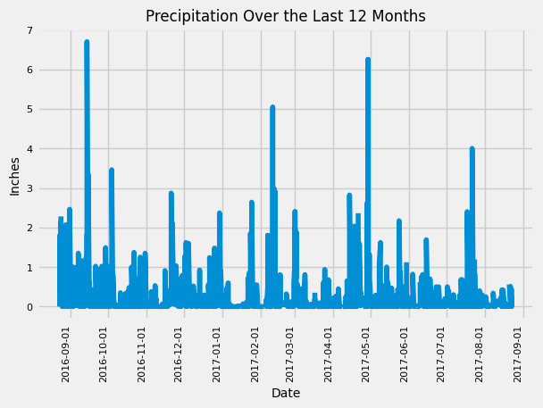
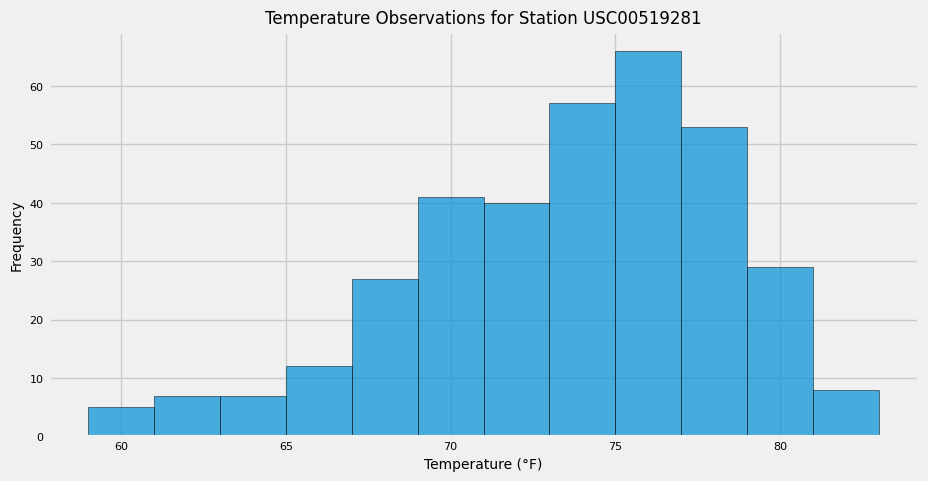

#### Module 10 Challenge
# sqlalchemy-challenge

**Instructions**
Congratulations! You've decided to treat yourself to a long holiday vacation in Honolulu, Hawaii. To help with your trip planning, you decide to do a climate analysis about the area. The following sections outline the steps that you need to take to accomplish this task.

## Part 1: Analyze and Explore the Climate Data
In this section, you’ll use Python and SQLAlchemy to do a basic climate analysis and data exploration of your climate database. Specifically, you’ll use SQLAlchemy ORM queries, Pandas, and Matplotlib

Doing this analysis we created a plot that shows precipatation for the last 12 month to choose best date for vacation. 

Also I calculated the summary statistics for the precipitation data:

count	2021.000000
mean	0.177279
std	0.461190
min	0.000000
25%	0.000000
50%	0.020000
75%	0.130000
max	6.700000

We have found most active stations:
Station: USC00519281, Observations: 2772
Station: USC00519397, Observations: 2724
Station: USC00513117, Observations: 2709
Station: USC00519523, Observations: 2669
Station: USC00516128, Observations: 2612
Station: USC00514830, Observations: 2202
Station: USC00511918, Observations: 1979
Station: USC00517948, Observations: 1372
Station: USC00518838, Observations: 511

And some statisrics for most active station:
Most Active Station: USC00519281
Temperature statistics for station USC00519281:
Lowest Temperature: 54.0°F
Highest Temperature: 85.0°F
Average Temperature: 71.66°F

also, using the most active station id, I have created a histogram for the last 12 months of temperature observation data for this station.

## Part 2: Design Your Climate App

you can run the app from the directory /SurfsUp/app.py
it worked with no problems.

-----
all code was created by me with some help of chatGPT